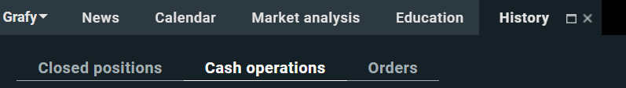
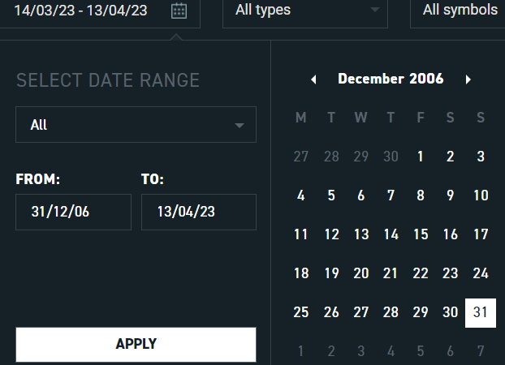
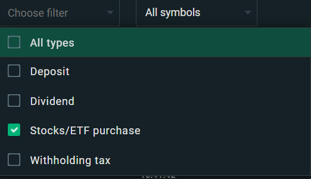

# xtb-csv-for-divtracker-app

Python project to transform a csv file from XTB into a csv file that can be used for a divtracker app.

## Index

- [Screenshot](#screenshot)
- [Requirements](#requirements)
- [General](#general)
- [Usage](#usage)
- [Resources](#resources)
- [ToDo](#todo)
- [Other](#other)

## Screenshot

1. In [Xstation5](https://xstation5.xtb.com/) click on **History** > **Cash operations**

2. Choose **Date** Range

3. Check **Stocks/ETF purchase** and **Stocks/ETF sale** only

4. Click **Export button** and choose **Cash Operations** > **CSV** and then click **Export Report**

## Requirements

- install
  ``
  pip install -r requirements.txt
  ``

## General

- simplifying the process of converting a csv file

## Usage

1. Enter the path **to** your csv file
2. Enter the path for your **output** csv file
3. The **output** csv file can be imported to **Transactions** in the **app**

## Resources

- csv file from [XTB](https://www.xtb.com/)
- csv file to [DivTracker](https://play.google.com/store/apps/details?id=com.divtracker.stockapp)

## ToDo

- [x] Add your own path to file and output file
- [ ] Add function for **sold** Stocks/ETF
- [ ] Add to csv file Stocks/ETF traded **only** on the **US** stock exchange for a better app experience
- [ ] Add function to **merge** csv files from **Trading212** and **XTB** so that we can import from only **one** csv in
  the app

## Other

- If you find any issue, please don't hesitate to report it
  via [Issues](https://github.com/Fearplay/xtb-csv-for-divtracker-app/issues)
- If you have an idea to improve this game, please don't hesitate to create pull request
  via [Pull requests](https://github.com/Fearplay/xtb-csv-for-divtracker-app/pulls)
- Thanks to all :green_heart:

[Back to TOP](#xtb-csv-for-divtracker-app)